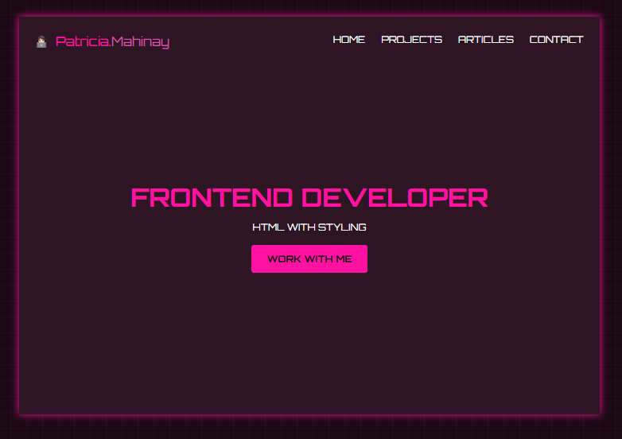
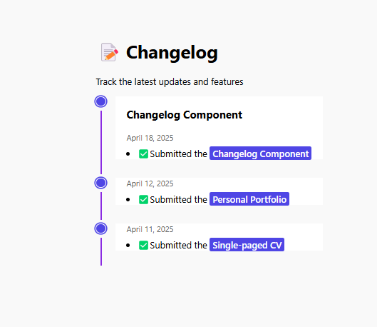
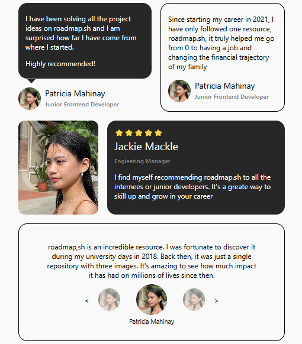
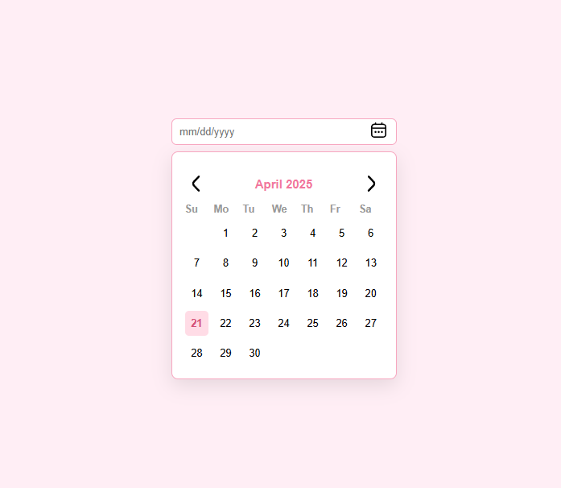
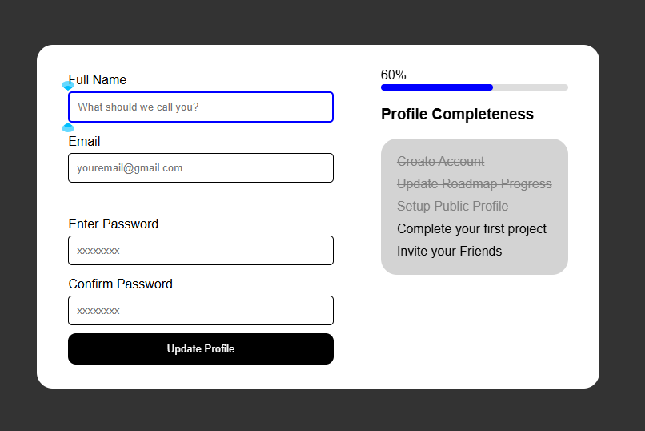
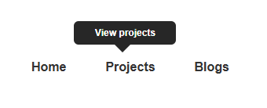

# [Roadmap](https://roadmap.sh/frontend/projects) Frontend Projects
This repository contains front-end projects built following the roadmap.sh front-end developer path.

### Beginner Level
1. [Single-paged CV](https://roadmap.sh/projects/single-page-cv) -  a single-page CV (Curriculum Vitae) using **HTML** only.
   - my [solution](basic-html-website/) - HTML only
   - [live demo](https://ptrcmahinay.github.io/single-paged-resume-pdf/) - updated with CSS and JS 
2. [Basic HTML Website](https://roadmap.sh/projects/basic-html-website) - structure a website using HTML i.e. different sections of a website like header, footer, navigation, main content, sidebars etc. 
   - my [solution](single-page-cv/)
3. **[Personal Portfolio](https://roadmap.sh/projects/portfolio-website)** - Convert the previous simple HTML website into a personal portfolio.
   - my [solution](personal-portfolio/)

4. **[Changelog Component](https://roadmap.sh/projects/changelog-component)** - create a simple HTML structure and use CSS to style it into a visually appealing and responsive changelog component. 
     - my [solution](changelog-component/)

5. **[Testimonial Cards](https://roadmap.sh/projects/testimonial-cards)** - to teach about positioning and layout in CSS.
    - my [solution](testimonial-cards/)

6. **[Datepicker UI](https://roadmap.sh/projects/datepicker-ui)** - create a simple datepicker UI using only HTML and CSS. It will not be a functional datepicker, but a static UI component that can later enhance with JavaScript.
    - my [solution](datepicker/)

7. **[Accessible Form UI](https://roadmap.sh/projects/accessible-form-ui)** - create a form UI using only HTML and CSS, it will be a static UI component that can be enhance with JavaScript in the future.
    - my [solution](accessible-form/)

8. **[Tooltip UI](https://roadmap.sh/projects/tooltip-ui)** - A tooltip is a small pop-up box that provides additional information about a navigation item when a user hovers over it.
   - my [solution](tooltip/)

9. **[Image Grid Layout](https://roadmap.sh/projects/image-grid)** - learn and practice the CSS Grid layout technique, which is essential for creating responsive and flexible web layouts.
    - my [solution](tooltip/)
